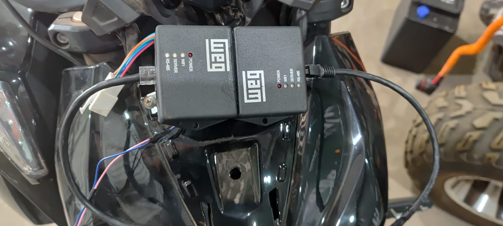

# DMS Portable Logger

Logger experimental e gateway JBD estritamente read-only para uma motocicleta DMS, construído com dois ED100/ESP32-WROOM-32E. O MasterLogger consulta o BMS; o SlaveLogger entrega ao painel respostas JBD validadas e registra telemetria, comunicação e transações.


*Protótipo inicial de desenvolvimento. Fotografia: Pedro Akio Sakuma, 2026.*

## Protótipo instalado

Protótipo do DMS Portable Logger instalado para validação estática na motocicleta. Os dois ED100 atuam como master logger e slave logger/gateway do painel.



> [!WARNING]
> Projeto experimental, sem isolamento galvânico, certificação funcional ou aprovação dos fabricantes. Faça ligações e testes somente com a motocicleta parada, roda sem possibilidade de tração e carregador desconectado. O BMS continua responsável por todas as proteções.

## Estado do projeto

Primeira validação física estacionária concluída em 2026-08-21, com a motocicleta parada, BMS JBD, dois ED100 e painel real:

- leitura do BMS pelo MasterLogger;
- DMS-Link entre os dois ED100;
- request JBD `0x03` recebido do painel;
- resposta do SlaveLogger aceita pelo painel;
- SOC `100%` exibido no painel;
- 45 respostas consecutivas após a recuperação automática da inicialização;
- logs Master e Slave criados, baixados e validados pelo decoder, sem corrupção ou descartes;
- amostras em torno de 1 Hz, com células, temperaturas, frames brutos e transações do painel.

Os builds e testes automatizados estão aprovados. Testes em movimento, ensaios prolongados, descarga até SOC baixo, autonomia do pack portátil e comportamento até memória cheia continuam pendentes. Os números medidos pertencem à bateria e à sessão do ensaio, não são especificações universais. Consulte os [resultados de validação](docs/validation-results.md), os [testes](docs/testing.md) e o [checklist estacionário](docs/stationary-motorcycle-test.md).

## Como funciona

```text
BMS JBD <-- RS485 9600 8N1 --> MasterLogger
                                      |
                              UART0 / DMS-Link
                                  230400 baud
                                      |
Painel  <-- RS485 9600 8N1 --> SlaveLogger
```

### MasterLogger

- consulta `0x03` e `0x04` a cada segundo;
- publica um snapshot somente quando informações básicas e células pertencem ao mesmo ciclo válido;
- consulta `0x05` no início e, depois, a cada hora;
- atende snapshot, registradores, frames brutos, horário, ping e proxy read-only pelo DMS-Link;
- grava `MASTER_SAMPLE`, `POLL_ERROR`, eventos e frames JBD selecionados.

### SlaveLogger

- é o único proprietário da UART/RS485 do painel;
- prioriza requests do painel e mantém uma sequência coerente durante bursts;
- usa cache fresco até 2,5 s, permite resposta stale sinalizada até 5 s e rejeita dados mais antigos;
- coleta snapshots do Master em background;
- grava `SLAVE_SAMPLE`, `PANEL_TRANSACTION`, eventos e frames inválidos/bloqueados.

### Segurança read-only

Leituras `0x03`, `0x04` e `0x05` usam frames brutos validados. `0x0F` e outras leituras desconhecidas podem usar proxy sem interpretação. Qualquer ação JBD `0x5A`, inclusive controle MOS `0xE1`, é bloqueada e nunca encaminhada ao BMS. O gateway não altera SOC, RmCap, calibração, proteções ou MOSFETs.

## Estrutura do repositório

| Caminho | Conteúdo |
| --- | --- |
| `masterlogger/` | Firmware do lado BMS |
| `slavelogger/` | Firmware do lado painel |
| `shared/DmsCommon/` | Biblioteca canônica compartilhada |
| `tools/` | Decoder, testes e emuladores de bancada |
| `docs/` | Protocolos, arquitetura, segurança e validação |
| `.github/workflows/build.yml` | CI dos dois firmwares e testes |

O pré-build copia `shared/DmsCommon` para `masterlogger/lib` ou `slavelogger/lib`, ambos ignorados pelo Git. Isso evita falhas do toolchain Windows em caminhos Unicode. Nunca edite essas cópias; altere somente a fonte canônica.

## Hardware e ligações

A pinagem canônica está em `shared/DmsCommon/src/Ed100Pins.h`.

| Função | GPIO |
| --- | --- |
| UART0 TX/RX — DMS-Link | 1 / 3 |
| UART2 TX/RX — RS485 | 17 / 16 |
| Direção RS485 | 4 |
| RTC I²C SDA/SCL | 21 / 22 |
| LEDs | 32/33, 25/26 e 27/14 |

Entre os ED100:

- TX0 Master → RX0 Slave;
- RX0 Master → TX0 Slave;
- GND → GND;
- não una os pinos 3,3 V;
- desconecte o outro ED100 ao gravar pela UART0.

BMS deve ficar somente no RS485 do Master e painel somente no RS485 do Slave. A/B não possui nomenclatura universal; confirme polaridade, alimentação, referência e modo comum com o sistema desenergizado. Veja [wiring.md](docs/wiring.md).

## Requisitos de desenvolvimento

- Python 3.12 ou compatível;
- PlatformIO Core 6.1.19 recomendado;
- cabo USB/serial adequado ao ED100;
- flash ESP32 de 4 MiB.

Instalação do PlatformIO:

```powershell
python -m pip install platformio==6.1.19
pio --version
```

## Compilar e testar

Execute na raiz do repositório:

```powershell
pio test -d masterlogger -e native
pio test -d slavelogger -e native
pio run -d masterlogger
pio run -d slavelogger
python -m unittest -v tools/test_tools.py
```

Saída esperada: testes `PASSED` e builds `SUCCESS`. Os binários ficam em:

```text
masterlogger/.pio/build/esp32dev/firmware.bin
slavelogger/.pio/build/esp32dev/firmware.bin
```

Resultados da última validação local:

| Alvo | Testes | RAM | Flash |
| --- | ---: | ---: | ---: |
| Master native | 14/14 | — | — |
| Slave native | 3/3 | — | — |
| Ferramentas Python | 8/8 | — | — |
| Master ESP32 | SUCCESS | 48.352 B (14,8%) | 881.385 B (56,0%) |
| Slave ESP32 | SUCCESS | 47.704 B (14,6%) | 878.801 B (55,9%) |

## Gravar os firmwares

Com os dois ED100 separados durante a gravação:

```powershell
pio run -d masterlogger -t upload
pio run -d slavelogger -t upload
```

Se necessário, indique a porta:

```powershell
pio run -d masterlogger -t upload --upload-port COM5
pio run -d slavelogger -t upload --upload-port COM6
```

Não troque os firmwares: o Master é ligado ao BMS e o Slave ao painel.

## LittleFS e primeira inicialização

A tabela de 4 MiB, sem OTA, é igual nos dois projetos:

| Partição | Offset | Tamanho |
| --- | ---: | ---: |
| NVS | `0x9000` | `0x5000` |
| PHY | `0xE000` | `0x1000` |
| Firmware | `0x10000` | `0x180000` |
| `littlefs` | `0x190000` | `0x270000` (2,4375 MiB) |

A última partição termina exatamente em `0x400000`. O rótulo `littlefs` corresponde explicitamente a:

```cpp
LittleFS.begin(false, "/littlefs", 10, "littlefs");
```

Não existe formatação automática. Em cada ED100:

1. conecte ao AP correspondente;
2. abra `http://192.168.4.1/api/status`;
3. confirme `partition_found=true` e `partition_label="littlefs"`;
4. se `fs_mounted=false` e a partição for comprovadamente virgem, abra a página principal;
5. pressione **Inicializar LittleFS**;
6. confirme o aviso com a motocicleta parada;
7. digite exatamente `INITIALIZE-LITTLEFS`;
8. aguarde o reinício;
9. confirme `fs_mounted=true`, `logging=true` e um arquivo de pelo menos 64 bytes em `/api/logs`.

Se o dispositivo já possuía logs e deixou de montar, não formate. Preserve a flash e investigue uma recuperação externa.

Como alternativa exclusiva de provisionamento:

```powershell
pio run -d masterlogger -t uploadfs
pio run -d slavelogger -t uploadfs
```

`uploadfs` sobrescreve toda a partição de arquivos. Nunca o use antes de preservar logs existentes.

## Wi‑Fi e operação diária

| Dispositivo | SSID | Canal | Endereço |
| --- | --- | ---: | --- |
| Master | `DMS-MasterLogger-XXXX` | 1 | `http://192.168.4.1/` |
| Slave | `DMS-SlaveLogger-XXXX` | 6 | `http://192.168.4.1/` |

Senha fallback de desenvolvimento: `dmslogger`.

Para definir uma senha local sem versioná-la, crie estes arquivos:

```text
masterlogger/include/secrets.h
slavelogger/include/secrets.h
```

Conteúdo:

```cpp
#pragma once
#define DMS_AP_PASSWORD "substitua-por-uma-senha-local"
```

`secrets.h` é ignorado pelo Git e a senha não aparece nas APIs.

Fluxo normal:

1. energize o gateway com a motocicleta parada;
2. confirme LED Server verde nos dois ED100;
3. consulte telemetria, comunicação e armazenamento pela página;
4. sincronize o relógio, se necessário;
5. deixe o logger gravar;
6. use **Finalizar e baixar** para fechar a sessão ativa e baixar uma cópia estável;
7. preserve os logs antes de atualizar firmware ou filesystem.

O download simples do arquivo ativo executa `flush()`, mas a sessão continua aberta. Para coleta definitiva, prefira **Finalizar e baixar**.

## Interface web e API

A página é responsiva, funciona sem internet/CDN e atualiza telemetria sem recarregar. Ela mostra células, mínima/máxima/média/delta, SOC, proteções, FETs, balanceamento, temperaturas, comunicação e estado do armazenamento.

| Método | Endpoint | Função |
| --- | --- | --- |
| GET | `/api/status` | Diagnóstico completo do dispositivo, RTC, partição e logger |
| GET | `/api/live` | Snapshot e contadores de comunicação |
| GET | `/api/logs` | Lista arquivos, tamanhos, estado e URLs |
| GET | `/api/logs/{nome}` | Baixa DMSLOG em streaming |
| GET | `/api/logs/{nome}/csv` | Valida e exporta CSV |
| POST | `/api/session/rotate` | Fecha o ativo e inicia nova sessão |
| POST | `/api/time` | Define epoch UTC em milissegundos |
| POST | `/api/storage/initialize` | Formata conscientemente com `INITIALIZE-LITTLEFS` |
| DELETE | `/api/logs/{nome}` | Exclui somente arquivo inativo |
| POST | `/api/logs/erase-all` | Apaga inativos com `ERASE-ALL` |

Mount falho retorna HTTP 503 em `/api/logs`, em vez de uma lista vazia ambígua. Nomes com traversal, barras, controles, aspas ou extensão diferente de `.dmslog` são rejeitados. O arquivo ativo nunca pode ser excluído.

## Arquivos de log

Cada `.dmslog` começa com cabeçalho `DMSLOG2` de 64 bytes e usa registros enquadrados com CRC32. Arquivos giram em 512 KiB. Com menos de 64 KiB livres, o logger para sem apagar logs antigos. A duração depende da taxa real; não há promessa de 24 horas.

Registros incluem samples Master/Slave, falhas de polling, transações do painel, frames JBD, eventos de sistema/link e alterações de horário. Frames `0x03`, `0x04` e `0x05` são persistidos no início, quando mudam e a cada 60 s; erros, proxy, comandos desconhecidos e writes bloqueados são sempre preservados.

Decodificação:

```powershell
python tools/dmslog_decode.py arquivo.dmslog `
  --csv amostras.csv `
  --transactions painel.csv `
  --unknown desconhecidos.jsonl
```

O decoder valida cabeçalho e CRC, tolera somente o último registro truncado e rejeita corrupção intermediária. Consulte [log-format-v2.md](docs/log-format-v2.md).

## LEDs

| Grupo | Estado | Significado |
| --- | --- | --- |
| Wi‑Fi | verde | AP pronto |
| Wi‑Fi | vermelho | falha ao criar AP |
| Wi‑Fi | âmbar | cliente conectado |
| Server | verde | LittleFS montado e logger ativo |
| Server | âmbar | ocupação ≥85% |
| Server | vermelho lento | ocupação ≥95% |
| Server | vermelho fixo | mount ou logger parado |
| RS485 | pulso verde | frame válido |
| RS485 | pulso vermelho | erro/timeout |
| RS485 | vermelho lento | BMS/Master offline |
| RS485 | vermelho duplo | proteção reportada pelo BMS |
| RS485 | âmbar rápido | cache/proxy/stale |

## Falhas e recuperação

- BMS offline: conserva o último snapshot válido e registra `POLL_ERROR`.
- Master offline: Slave usa cache somente dentro da janela máxima de 5 s.
- RTC inválido: monotonic/age continuam válidos e o relógio é marcado como não configurado.
- LittleFS indisponível: RS485 e DMS-Link continuam funcionando; logging permanece parado e diagnosticável.
- Fila cheia: o protocolo não bloqueia; apenas o registro é descartado e contabilizado.
- Reserva atingida: logger para antes de ocupar toda a partição e não exclui arquivos.
- Queda de energia: o decoder aceita somente o último registro truncado.

Não interprete ausência de dados como zero. Não formate automaticamente para “tentar resolver” uma falha de mount.

## Preparar uma tag e release

Este repositório ainda usa a versão `0.1.0`, gerada por `tools/stage_shared.py`. Antes de criar uma tag:

1. confirme a versão desejada e atualize `DMS_FIRMWARE_VERSION` em `tools/stage_shared.py`;
2. atualize `CHANGELOG.md`, trocando “Em desenvolvimento” pela data da release;
3. confirme que `shared/DmsCommon/library.json` usa versão compatível;
4. revise README, documentação, licença e limitações conhecidas;
5. execute o checklist físico nos dois ED100 e registre somente resultados realmente observados;
6. confirme que `masterlogger/partitions.csv`, `slavelogger/partitions.csv` e os dois `.gitkeep` estão versionados;
7. verifique que não existem credenciais, `secrets.h`, logs reais, CSV/XLSX, dumps ou binários acidentalmente incluídos;
8. execute toda a matriz de testes e builds;
9. confira que o working tree contém apenas alterações deliberadas;
10. faça o commit de release, tag anotada e push somente depois da revisão humana.

Auditoria recomendada:

```powershell
git status --short --untracked-files=all
git diff --check
git diff --stat
git diff
git check-ignore -v masterlogger/partitions.csv
git check-ignore -v slavelogger/partitions.csv

pio test -d masterlogger -e native
pio test -d slavelogger -e native
pio run -d masterlogger
pio run -d slavelogger
python -m unittest -v tools/test_tools.py
```

Os arquivos de release recomendados são:

```text
dms-portable-logger-master-vX.Y.Z.bin
dms-portable-logger-slave-vX.Y.Z.bin
SHA256SUMS.txt
```

Copie os `firmware.bin` gerados, renomeie-os de forma inequívoca e calcule checksums:

```powershell
Get-FileHash .\masterlogger\.pio\build\esp32dev\firmware.bin -Algorithm SHA256
Get-FileHash .\slavelogger\.pio\build\esp32dev\firmware.bin -Algorithm SHA256
```

Não publique `littlefs.bin` como atualização comum: gravá-lo sobrescreve os logs. Se uma imagem vazia for fornecida para provisionamento, marque-a claramente como destrutiva.

As notas da release devem informar:

- versão/tag e commit exato;
- hardware e topologia suportados;
- mudanças e correções;
- testes automatizados e físicos executados;
- tamanho de RAM/flash;
- instruções de gravação e primeira inicialização;
- compatibilidade do formato DMSLOG;
- limitações, riscos e itens ainda pendentes.

Exemplo de comandos, para execução manual somente após revisão:

```powershell
git commit -m "Release vX.Y.Z"
git tag -a vX.Y.Z -m "DMS Portable Logger vX.Y.Z"
git push origin main
git push origin vX.Y.Z
```

Estes comandos não são executados automaticamente por este projeto.

## Documentação

- [Arquitetura](docs/architecture.md)
- [Ligação elétrica](docs/wiring.md)
- [Protocolo JBD](docs/jbd-protocol.md)
- [DMS-Link](docs/dms-link-v1.md)
- [Mapa de registradores](docs/register-map-v1.md)
- [Formato de log](docs/log-format-v2.md)
- [Interface web](docs/web-interface.md)
- [LEDs](docs/leds.md)
- [Testes](docs/testing.md)
- [Resultados de validação](docs/validation-results.md)
- [Limitações e segurança](docs/limitations-and-safety.md)
- [Checklist estacionário](docs/stationary-motorcycle-test.md)

## Licença e autoria

Copyright © 2026 Pedro Akio Sakuma. Distribuído sob a [Licença MIT](LICENSE).

Projeto independente, sem vínculo, aprovação ou suporte dos fabricantes citados.
