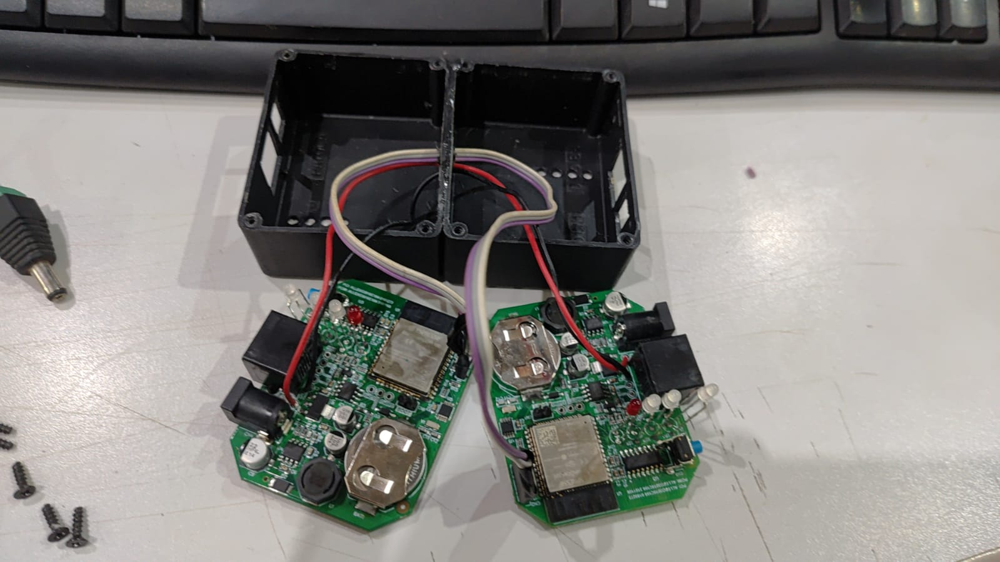

# Logger portátil DMS

Firmware experimental, read-only, para dois ED100 com ESP32-WROOM-32E. O `masterlogger` consulta o BMS JBD por RS485; o `slavelogger` representa os frames válidos ao painel. Os ED100 comunicam por DMS-Link v1 binário na UART0 a 230400 baud.



*Protótipo inicial de desenvolvimento com duas placas ED100 interligadas e acomodadas na caixa aberta. Fotografia: Pedro Akio Sakuma, 2026.*

```text
BMS JBD <-- RS485 9600 --> MasterLogger <-- UART0 TTL --> SlaveLogger <-- RS485 9600 --> painel
```

O projeto não altera SOC, RmCap, calibração, proteções ou MOSFETs. Requests JBD `0x5A`, inclusive `0xE1`, são bloqueados. `0x03`, `0x04` e `0x05` usam espelhamento do frame bruto; `0x0F` permanece sem interpretação e deve usar proxy.

## Hardware e segurança

A pinagem está centralizada em `Ed100Pins.h`. TX0 de um ED100 liga ao RX0 do outro, com GND lógico comum; não interligue as saídas 3,3 V. Desligue/desconecte o outro ED100 durante gravação. O ED100 analisado não possui isolamento galvânico nem cartão SD. Confirme referência elétrica, modo comum, polaridade A/B e alimentação antes de conectar à moto. Este equipamento não é certificado para segurança funcional.

## Build e testes

```sh
cd masterlogger && pio run
cd ../slavelogger && pio run
pio test -e native
```

Em Windows, toolchains antigos podem falhar com bibliotecas externas se o caminho contiver caracteres Unicode; use clone em caminho ASCII ou uma unidade mapeada. Testes `native` requerem GCC/G++ no PATH.

APs previstos: `DMS-MasterLogger-XXXX` (canal 1) e `DMS-SlaveLogger-XXXX` (canal 6), em `http://192.168.4.1/`. A senha inicial está em `AppConfig.h` e deve ser trocada antes do uso. A interface web e persistência completa permanecem em integração nesta versão de desenvolvimento.

Logs `.dmslog` usam registros versionados e CRC. A autonomia não pode ser prometida: depende da flash/partição e da taxa medida; 24 células por segundo ocupam vários MB/dia.

Consulte `docs/testing.md`, `docs/wiring.md` e `docs/limitations-and-safety.md`. Autor: Pedro Akio Sakuma. Licença MIT.
