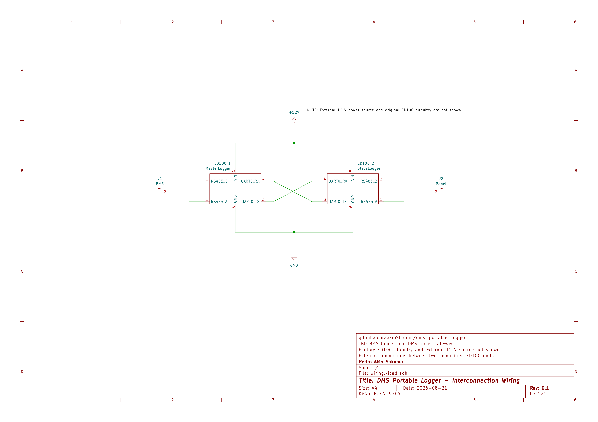

# Ligação elétrica

O desenho representa somente as conexões externas acrescentadas entre dois ED100 sem modificações internas. O BMS JBD pertence ao MasterLogger, o painel pertence ao SlaveLogger, e os ED100 trocam dados por UART0/DMS-Link. A fonte externa de 12 V e os circuitos internos originais dos ED100 não são detalhados.

## Diagrama de interligação

*Figura 1 — ED100 MasterLogger entre o BMS JBD e o ED100 SlaveLogger/gateway do painel. Clique na imagem para abrir o PDF em alta resolução.*

## Conexões

- BMS JBD conectado ao canal RS485 do MasterLogger: A com A e B com B.
- TX0 do MasterLogger conectado ao RX0 do SlaveLogger.
- RX0 do MasterLogger conectado ao TX0 do SlaveLogger.
- GND comum entre os dois ED100.
- RS485 do SlaveLogger conectado ao painel: A com A e B com B.
- Os dois ED100 recebem a alimentação externa comum de 12 V mostrada no diagrama.
- Não interligar os pinos de 3,3 V dos dois ED100.
- Não conectar BMS e painel ao mesmo transceiver RS485.

## Parâmetros de comunicação

- UART0/DMS-Link entre os ED100: `230400 8N1`.
- RS485 do BMS e do painel: `9600 8N1`, half-duplex.

## GPIOs usados pelo firmware

| Função | GPIO |
| --- | --- |
| UART0 TX/RX — DMS-Link | 1 / 3 |
| UART2 TX/RX — RS485 | 17 / 16 |
| Direção do transceiver RS485 | 4 |
| RTC I²C SDA/SCL | 21 / 22 |
| LEDs | 32/33, 25/26 e 27/14 |

A fonte canônica da pinagem é `shared/DmsCommon/src/Ed100Pins.h`.

## Cuidados

- A identificação A/B varia entre fabricantes; confirmar a polaridade com o sistema desenergizado.
- Confirmar alimentação, referência de terra e faixa de modo comum antes de energizar.
- Fazer as ligações com a motocicleta desligada e o carregador desconectado.
- Durante a gravação de firmware, desconectar o par da UART0 para evitar disputa com o bootloader.
- Não unir os pinos de 3,3 V e não improvisar conexão entre potenciais desconhecidos.
- O hardware analisado não possui isolamento galvânico nem certificação de segurança funcional.
- O diagrama não reproduz o circuito interno original do ED100 nem a construção da fonte externa de 12 V.

Para a sequência segura de instalação e verificação, consulte [Validação estacionária](stationary-motorcycle-test.md).
